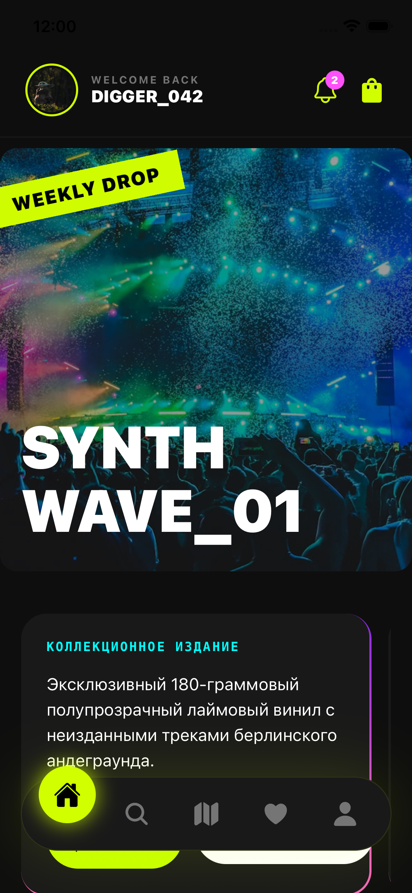
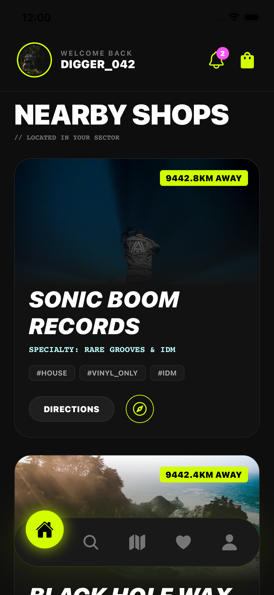
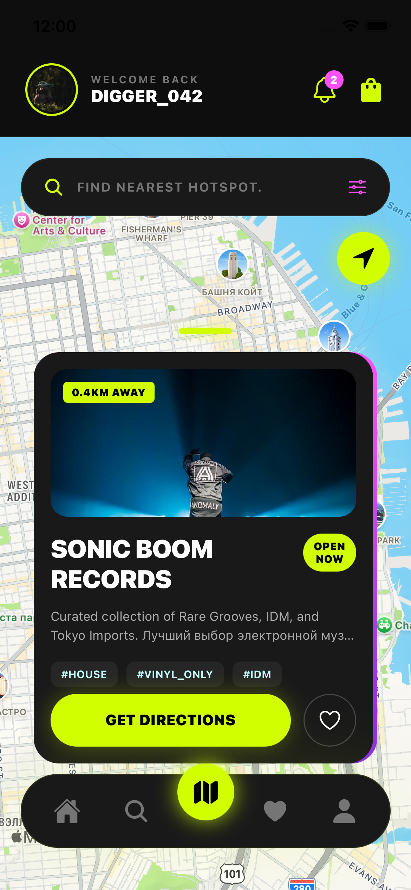
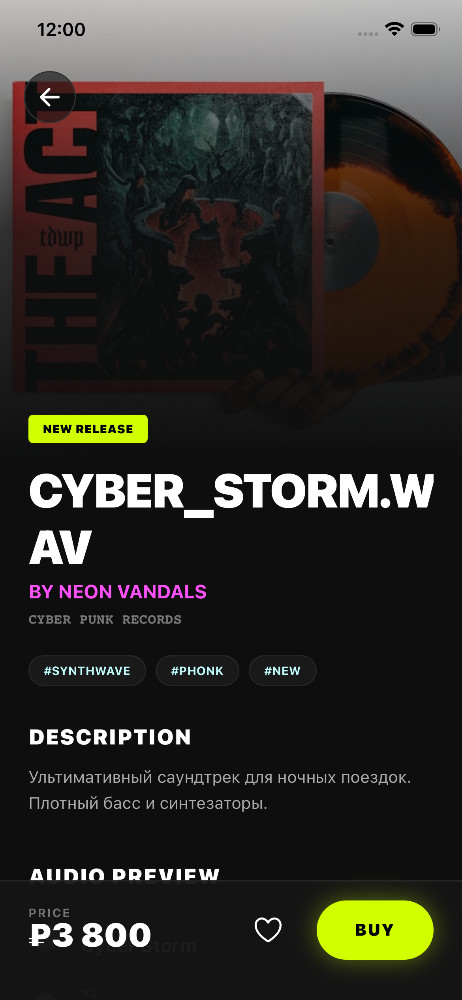
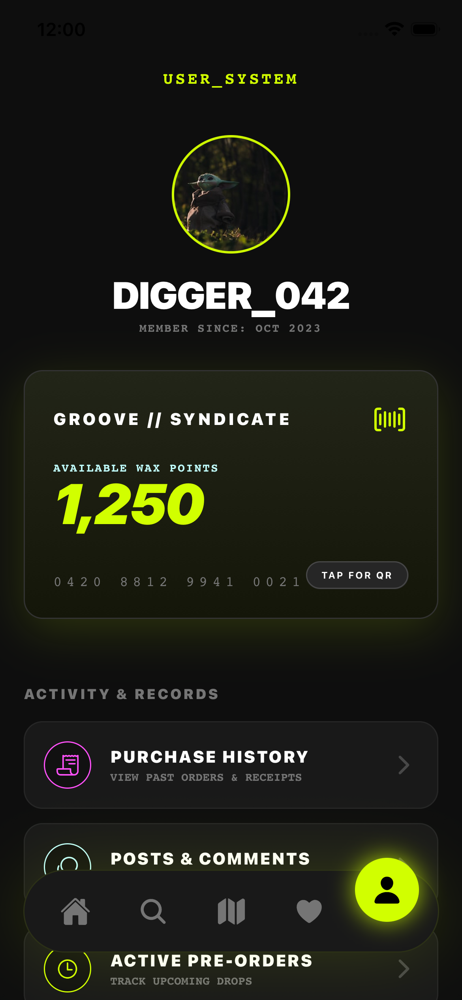

# Full-Stack Mobile Social Platform for Vinyl Community

## Overview

This is a full-stack mobile and web application designed for vinyl enthusiasts, DJs, and underground music communities.

The project combines a cross-platform mobile client with a scalable backend API, supporting user-generated content, geolocation-based discovery, and marketplace features.

---
**Key Features**
* User authentication (JWT-based)
* User profiles and personalized content
* Social features: posts, discussions, and interactions
* Marketplace functionality (favorites, cart, product browsing)
* Geolocation and map-based discovery
* Search and filtering system
* Cross-platform support (iOS, Android, Web)
---
## Tech Stack
**Frontend**

* React Native (Expo)
* TypeScript
* React Navigation
* Secure token storage (expo-secure-store)
* Maps and geolocation (react-native-maps, expo-location)

**Backend**
* FastAPI (Python)
* SQLAlchemy ORM
* PostgreSQL / SQLite
* JWT authentication (PyJWT)
* Password hashing (passlib)

**Infrastructure**
* Docker & Docker Compose
* REST API architecture
* Environment-based configuration (.env)

---
## System Architecture

The application follows a client-server architecture:
* Frontend communicates with backend via REST API
* Backend handles authentication, business logic, and data persistence
* Database stores users, products, and social interactions

**Backend Structure**
```
app/
  routers/
  models/
  schemas/
  services/
  core/
```
## API Highlights

* POST /auth/register — user registration
* POST /auth/login — authentication
* GET /products — product feed
* POST /favorites — manage favorites
* GET /locations — map data

---

## What I Implemented

* Designed and implemented REST API using FastAPI
* Built authentication system using JWT
* Structured backend into modular components (routers, services, models)
* Integrated database using SQLAlchemy
* Developed cross-platform mobile client using React Native
* Implemented state management and navigation flows
* Integrated geolocation and map-based features
* Set up Docker environment for full project deployment

## Demo

**Main screen**



**Map screen**


**Item screen**


**Settings screen**



## How to Run
**Backend**
```Bash
cd backend
python3 -m venv .venv
source .venv/bin/activate
pip install -r requirements.txt
uvicorn main:app --reload
```

**Frontend**
```Bash
cd frontend
npm install
npm run web
```

**Docker**
```Bash
docker compose up --build
```

## Future Improvements
* Real-time features (WebSockets)
* Recommendation system
* Payment integration
* Performance optimization and scaling

## Summary

This project demonstrates my ability to build and structure a full-stack application, including backend architecture, API design, and cross-platform mobile development.

It reflects experience with real-world features such as authentication, geolocation, and user interaction systems.